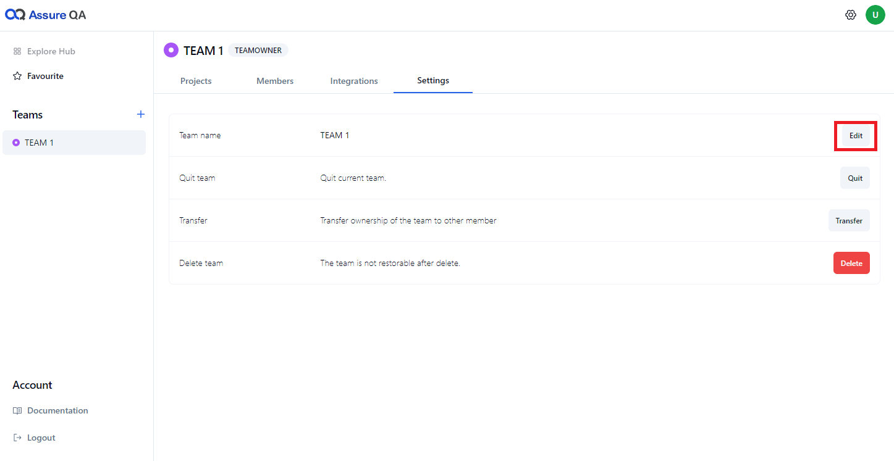
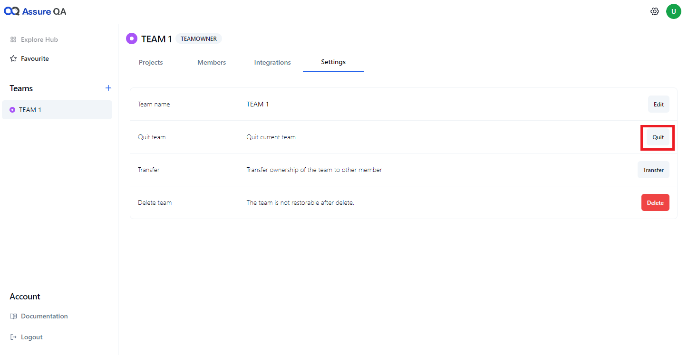
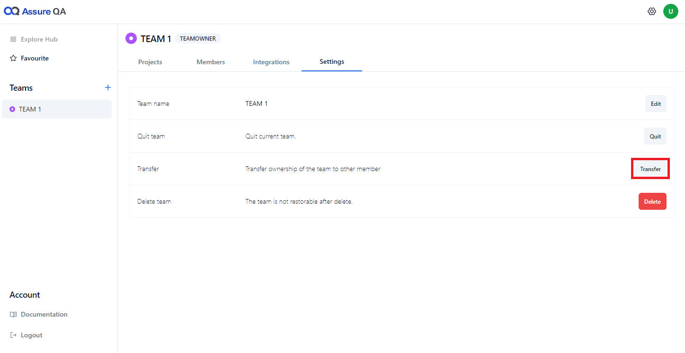
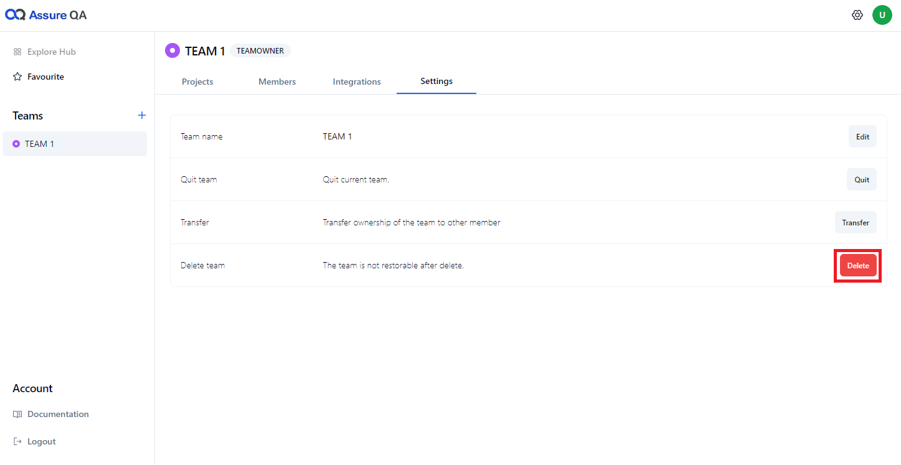

## Settings 

**Edit the team** 

- Team owners (or administrators) can edit the team name

**Quit the team**

- When you leave a team, you will lose access to all projects associated with that team.

> [!NOTE]
> If the team owner decides to quit, they must transfer ownership to another member before they can leave the team. 

**Transfer the team** 

- The team owner can transfer ownership permissions to any member of the team.

**Delete the team** 
  
- When a team is deleted. all projects associated with that team are deleted simultaneously and cannot be recovered.

