

## Team Creation
Assureqa provides team management features where each team can include multiple projects and members. The team owner can invite members to join the team and assign specific roles and permissions to protect projects and data. Team members can share data, edit tasks, and collaborate more effectively, enhancing overall team productivity.

**How to build a Team ?**

1. Click on the build your team button 

   
2. Enter the team name and click on create button the person who create the team became the team owner

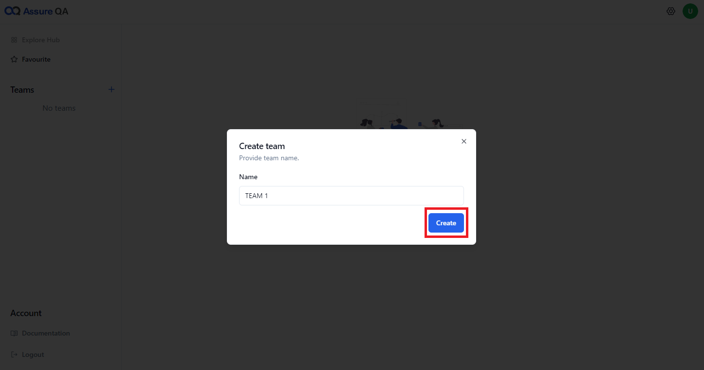

> [!Note]: 
> A team can be created by anyone who signs up on the Assureqa platform.

  **Project** 
 
Assureqa enables users to create independent workspaces, known as projects, where they can develop test cases, workflows, variables, and datasets.
Assureqa offers two types of projects  :web automation and API testing 

** Project Creation **

1. Click on Add Project

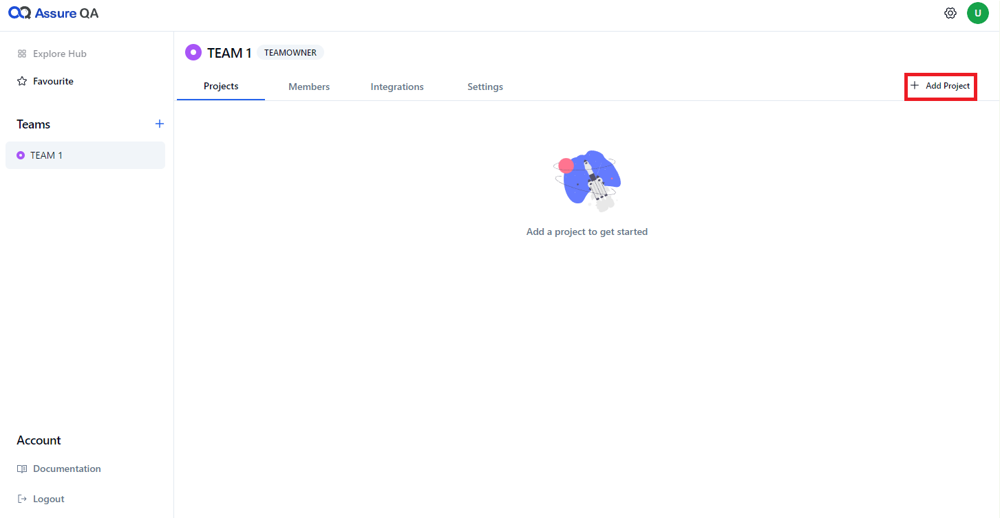

2. Enter the project name, select the desired type—either API test or web automation—and then click on "Create."

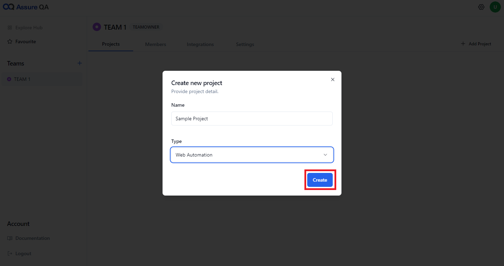
 
 **Inviting team members** 

Assureqa enables team owners and admins to add members to their respective teams, facilitating collaborative work on creating, editing, and managing . This leads to more comprehensive and effective test coverage. Additionally, it enhances communication and collaboration within the project.

1. Click on the invite button 

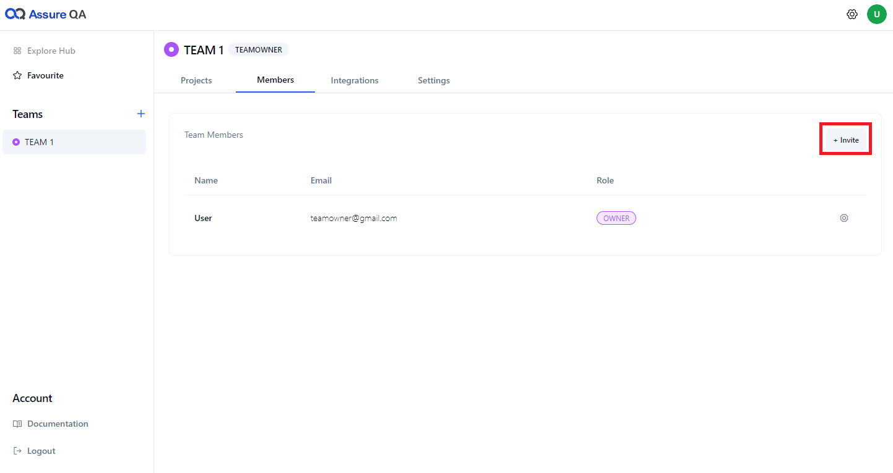

2. Enter a valid email address, select a role (such as Project Admin, Editor, Reader, Forbidden, or Custom), and click "Send Invite." The recipients will then receive an email to join the team.

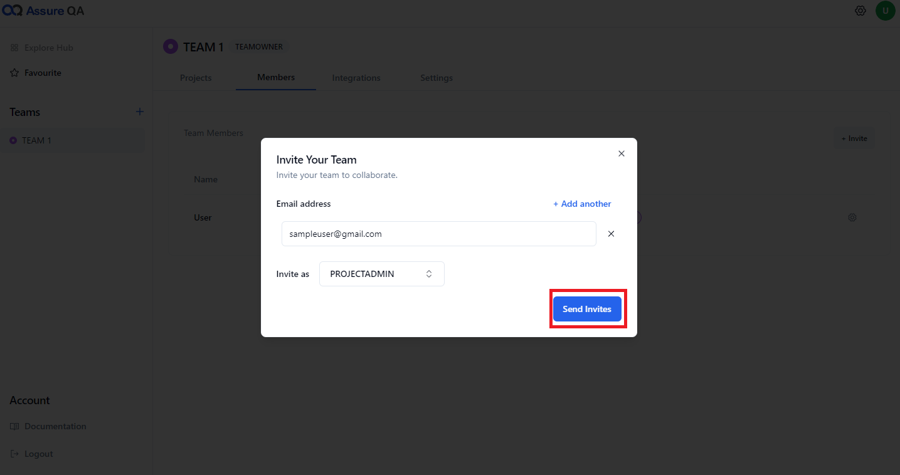

> [!NOTE]
> who can invite the member to the team?
> Team owner and team admin can invite the member to the team 

**Team Role**

There are two types of role in team management one is team member and   other team member 

1. Click on the icon next to the member's name, then select the desired team role.

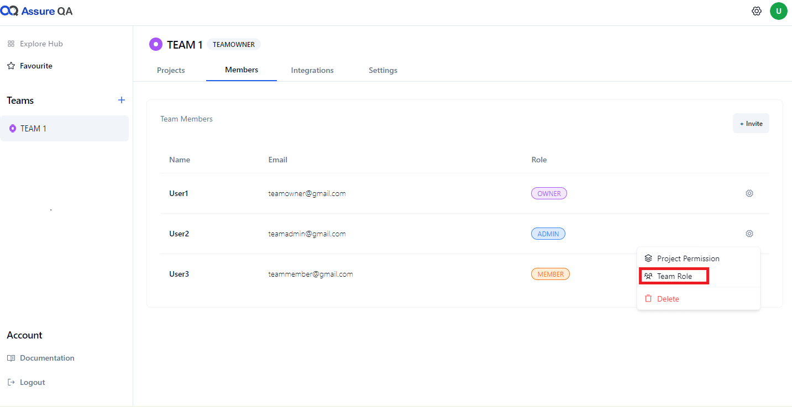

2. Select either Team Admin or Team Member, and then click "Update."

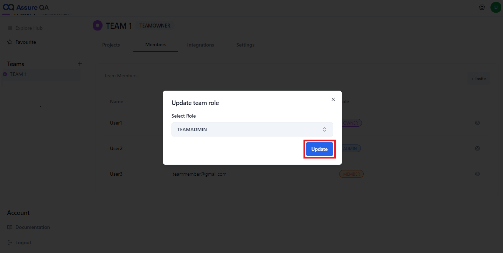

> [!Note] : 
> Only the team owner and team admin have the ability to change team roles.

 **Removing a team member**
 
 1. Click the icon next to the member's name and select the "Delete" option from the dropdown menu.

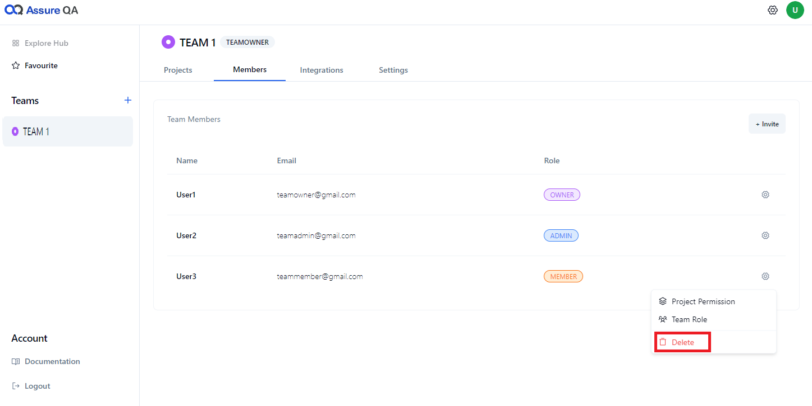

2. Click on the delete button displaying on the warning message 

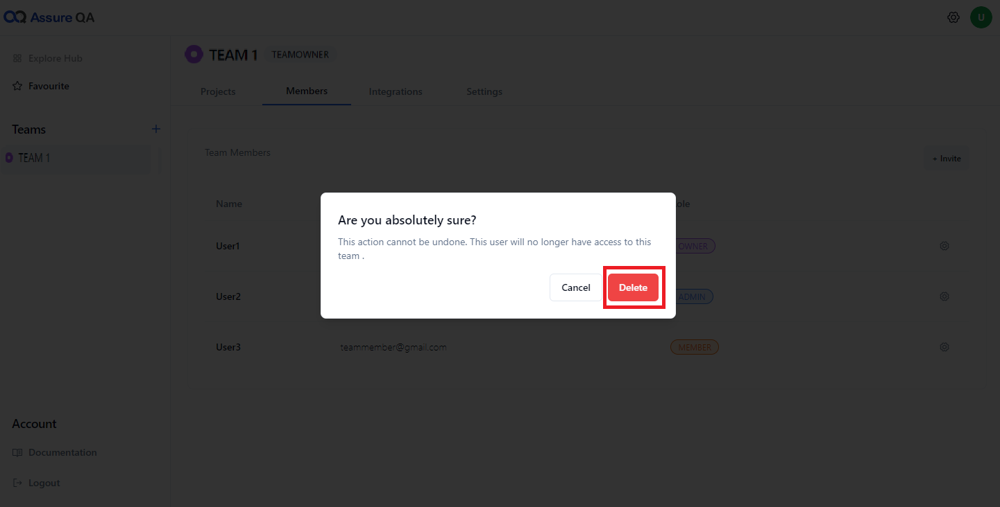

> [!Note]:
> Only the team owner and team admin can remove members from the team.
 
 **Project permission**
 
1. Click the icon next to the member's name, then select "Project Permissions."

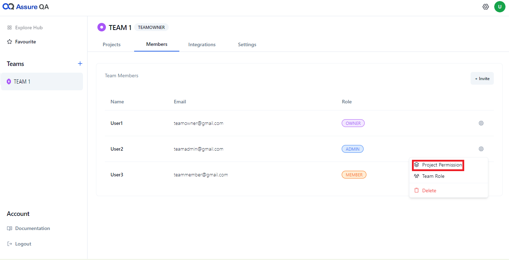

2. Choose the desired role from the dropdown menu and click the "Update" button.

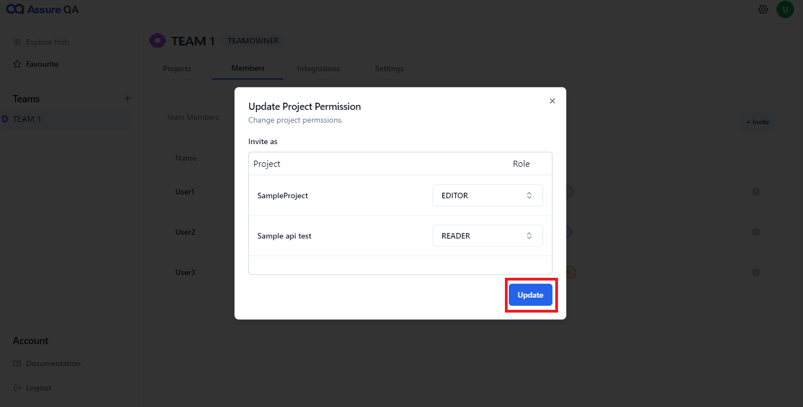

> [!Note]: 
> Only team Owner and Project Admin can change the permissions of members within their team.

