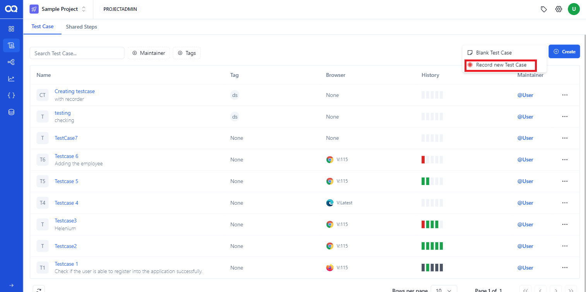

# Creating a Testcase

Let's explore the process of creating a test case.  
Navigate to the test case page and click on "Create", where you'll find two options: "Record New Test Case" and "Blank Test Case."

**Recording testcase using Ui sensor**

1. If you wish to record a script using the UI sensor, choose the "Record new Test Case" option. If you prefer to manually create a script, opt for "Blank Test Case." Here let's record a test case using the UI sensor.

2. Click on "Record new Test Case" and enter the site URL where you want to record the script (test case). And click the record button.

- Perform the desired actions, and the UI sensor will capture all actions performed during this session.

3. After performing required action, click on the red button to complete recording.

4. After completing the script, Save the recorded test case with a suitable name.

5. This action saves the recorded Testcase into the user account. Now the Testcase is created successfully.

**Blank Test**

1.  Blank test option lets users create Test step manually. When selecting the option, users will be prompted to enter the test case name, description, and a valid URL initially.

2.  After verifying the environment and  browser selection, click the 'Create' button. The test case will be successfully created based on the provided details.

3.  At this point, users can incorporate actions based on their preferences by clicking the "Add" button.

4. The step will be successfully added.

