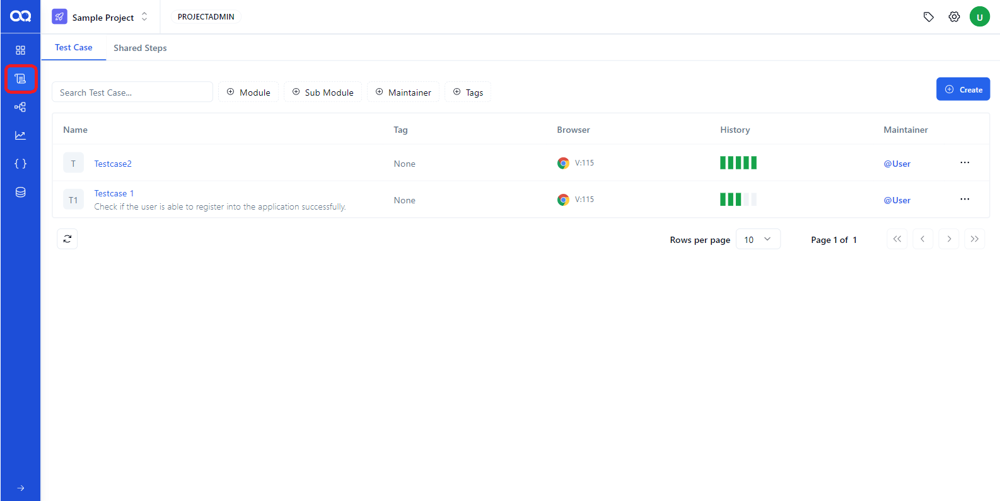
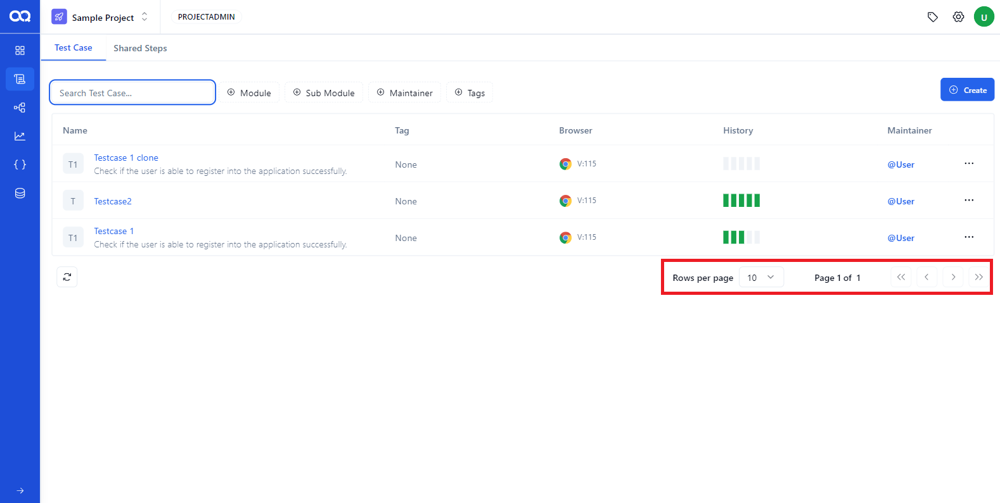

# Testcase

A test case is a structured set of steps and criteria used to assess whether a software program functions correctly. It defines what to do, what input to use, and what output to expect. Passing means the software works as intended, while failure indicates problems that need fixing. Test cases are vital for ensuring software quality and meeting specifications.

## Testcase Page

1. On this page, all created test cases are showcased. It includes the test case name, maintainer, test history, an option to execute a run for all test cases.

2. Furthermore, by clicking on the options icon on the right, users can access functionalities for  **cloning**,  **moving**  and  **deleting**  the test case.

**Clone** 

3. option enables the user to duplicate the selected test case. Another user’s test case can also be cloned with this feature.

**Move** 

4. Move option allows the user to relocate the test case to the chosen sub module.

**Delete** 

5. Delete option permits the user to erase the test case.

**Testcase page filters**

6. Users have the flexibility to filter test cases based on modules and submodules. Alternatively, they can utilize filters such as the maintainer's name or tags (if tags are utilized in the test case). Additionally, users can search for a test case by entering its name in the search field. To clear all these filters, users can simply click on the clear button.

-  A module serves as the main folder for saving the testcase, while a sub-module functions as a sub-folder within the module for testcase storage.
    
-  Select a Maintainer from the filter (Maintainer refers to the user). After selecting a maintainer, the number of Flows created under corresponding maintainer will be displayed.
    
-  Select a Tag from the filter. If there's a testcase associated with that tag, the relevant testcase will be displayed.
    
-  Type testcase name in Search box , then corresponding testcase will be displayed.
    
-  Reset button is used to Reset the entire filter.

**Navigation**

7. Users can navigate to other pages using this option.