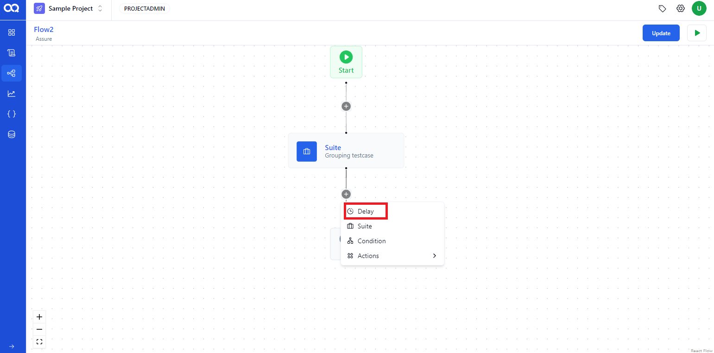

**Flow creation using multiple node**
 
User can use various node such as suite node, delay, condition, and email node. 
1. Create a flow using suite node. 

2. Fill the necessary fields, such as test case name, browser, environment, and version, and  add the test cases.

3. To add a delay node, click the plus button and choose the delay node from the dropdown  list

4. Click on the delay node, adjust the slider to the desired time, and the duration will be displayed on the node. 

5. To add condition node click on plus button and select the Conditional node from the dropdown list

6. Condition node decide the direction of flow execution based on the success or failure of the preceding suite node. If the primary suite node succeeds, then flow proceeds to the "Passed" condition or if it fails then it's  directs to the "Failed" condition
  

> [!Note]
> The condition option will only be enabled under a suite node. Ensure that you've added a suite node before attempting to add a condition node.

 

7. To add a mail node, choose the action from the dropdown menu and select the email option 

8.Mail node will be displayed on flow structure 

9. Next you can select the recipient to send email and proceed by clicking on the update button  This feature enables selected recipients to receive reports whenever the flow is executed.

