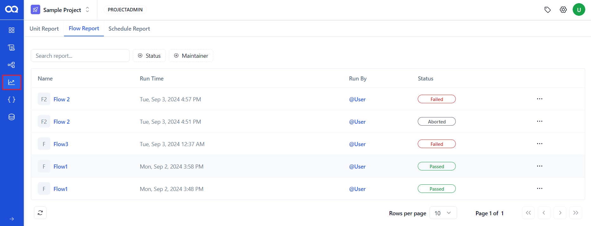
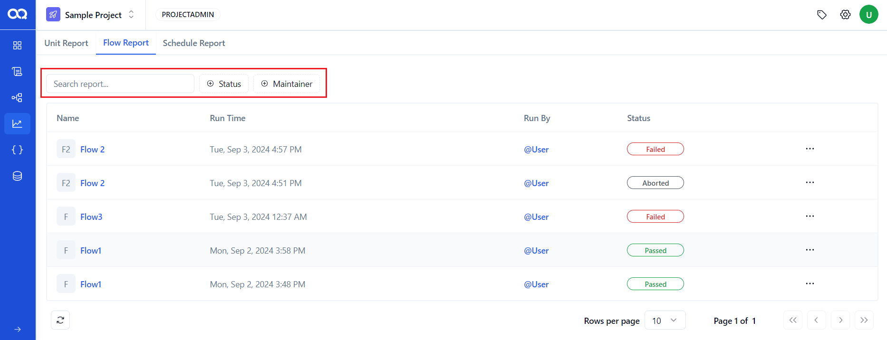
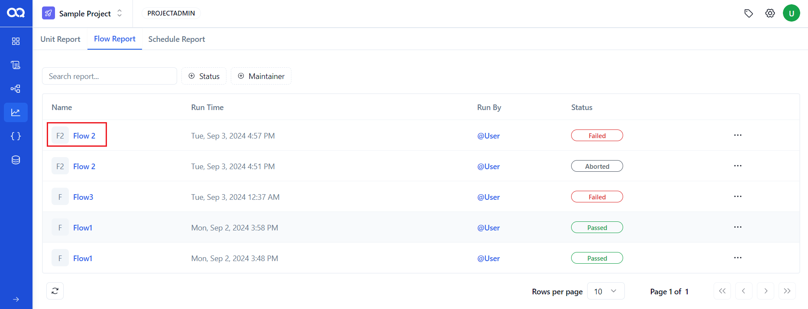
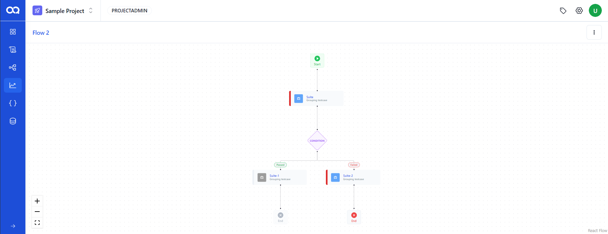
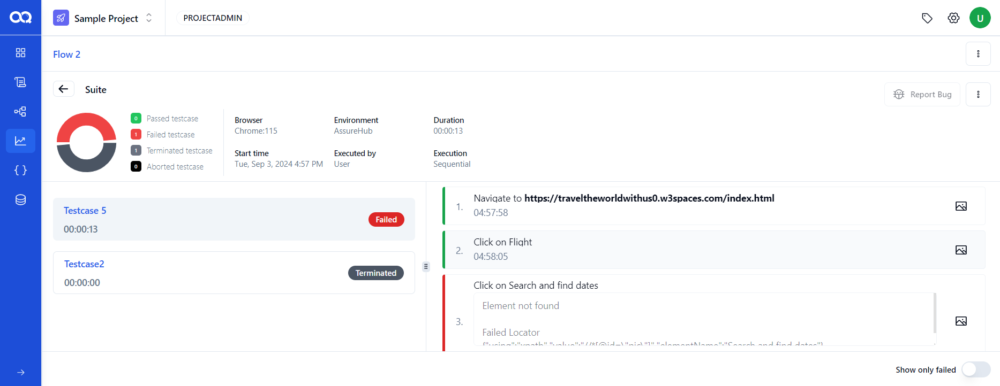
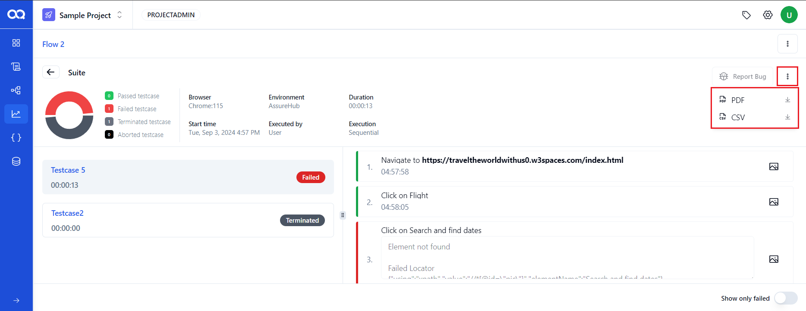
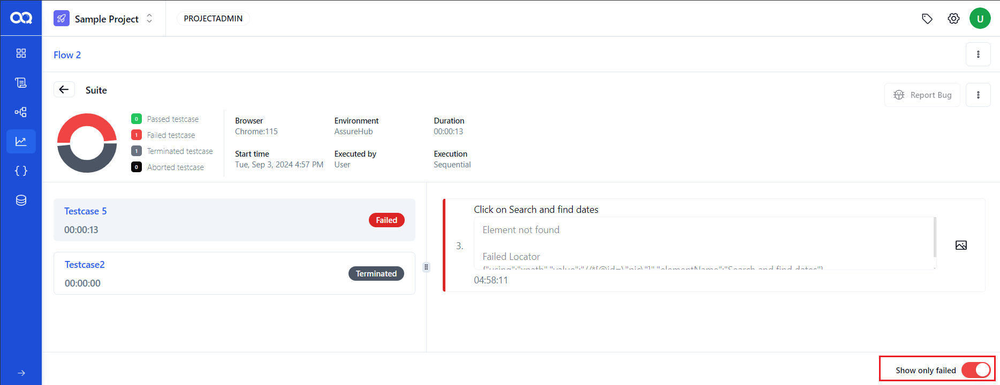
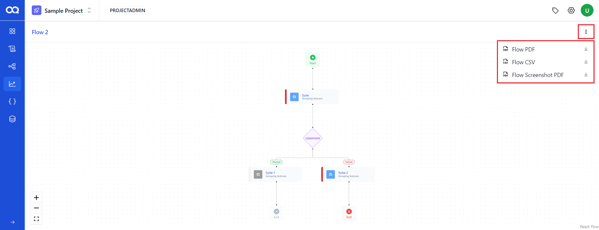

## Flow Reports
On this page, all flow reports are displayed.

Users can view the flow reports name, run time, run by, status (whether passed, failed, or aborted), and action (accessible via the three dots option, which includes a delete button).

Using the action option, the user can delete reports by clicking the delete button.

Users have the flexibility to filter flow reports by status (passed, failed, aborted, in-progress, container creating, terminated) and maintainer.

Additionally, they can search for a specific flow report by entering its name in the search field. To remove all filters, users can simply click the ‘reset’ button.

**Detailed flow report**

To view a detailed flow report, follow these steps

Select the desired flow report

The user is then directed to the detailed structure of the flow, with each node highlighted according to its status (passed or failed).

Clicking on each suite node will display a detailed summary report. This report includes a pie chart illustrating the status, along with details such as the browser used for execution, start time, environment, executed by, duration, execution method, and a list of test cases with their corresponding status.

Users can download a detailed PDF report and CSV report by clicking the three dots.

User can enable this toggle to view the failed test steps.

User can click this option to **report a bug** when it is enabled; otherwise, the option will appear disabled. To enable this option, each user must integrate their Jira account by providing unique inputs

By clicking the three dots, users can download flow PDF, flow CSV, and flow screenshot PDF.

