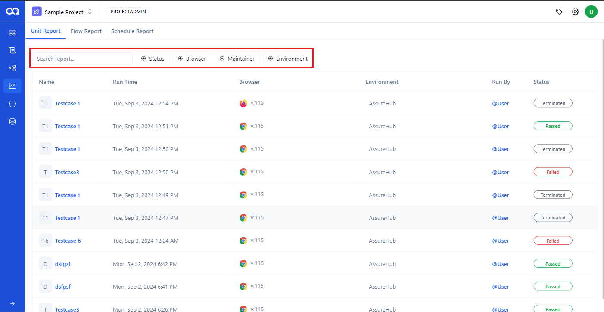

## Unit Reports
On this page, all test case reports will be displayed.

Users can view the details of each test case, including the name, run time, browser, environment, run by, and status (pass, fail, or aborted)

Users can also filter reports by status (passed, failed, aborted, in-progress, container creating, terminated), ran environment, and tags, or search by report name.

Additionally, users can navigate through the reports or adjust the number of rows displayed per page.

Detailed Report page

In this section, clicking on a report allows the user to access comprehensive details of the specific test case, including a detailed summary. The report includes a pie chart showing the status, along with details such as the browser used, start time, environment, executed by, duration, and execution status (passed, failed, passed with warning, passed with error and warning)

User can enable this toggle on the test report page to view the failed test steps.

User can click this option to report a bug when it is enabled; otherwise, the option will appear disabled. To enable this option, each user must integrate their Jira account by providing unique inputs.

