## Drive
Drive is the file storage system for Assure QA, where users can upload and store files.

On this page, users can attach small files and use their path in test steps.

Files are listed with details such as the file name (with a copy button), last modified date, and size. Users can also download, rename, and delete files by clicking the three dots.

**Upload a file**

To upload a file to Drive, follow these steps:

1. Click on **Upload File**.

2. Click on the **Upload File** button, then select the required/desired file.

Then, a prefix can be assigned to the file being uploaded if desired, but it is not mandatory.

3.Click on the **Upload** option

Now, the uploaded data will appear in the list on the Drive page.

User can **download**, **Rename**,  and **delete** the uploaded file by clicking on kebab menu

**Create folder**

User can create folders on this drive page.

1. Click on the **Create folder** option

2. Enter the desired folder name in the dialog box that appears when the user clicks ‘Create folder’

3. Click on **Create** button

Created folder will be displayed on the drive page.

Also, it is possible to upload files and create additional subfolders inside the created folder.

User created folder can be renamed and deleted by clicking on the kebab menu.

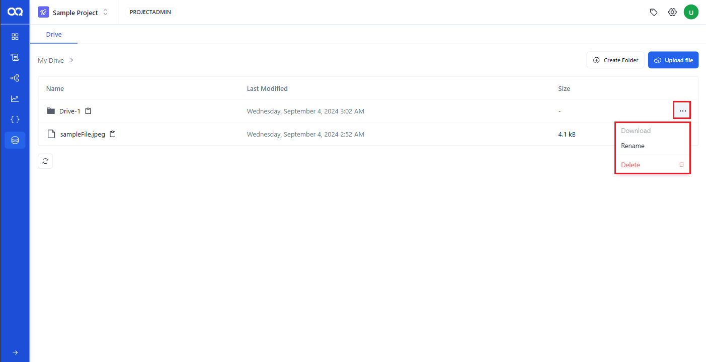

Deleted file will disappear from the page.

**Create Test step for Downloading File**

In AssureQA, the 'DownloadFile' keyword is used to automate file downloads.To use this keyword, you need to specify the file path where the file will be saved.
The drive will play a major role in this case. The steps below will tell you the role of drive in the downloadfile keyword:

1. Create a new folder in the drive.

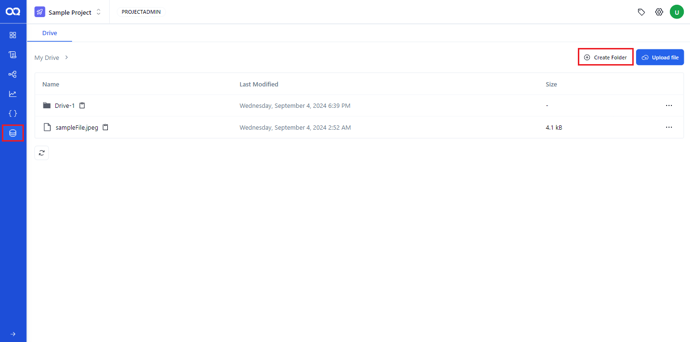

2. Enter the folder name ('Drive-2') and click ‘Save.’

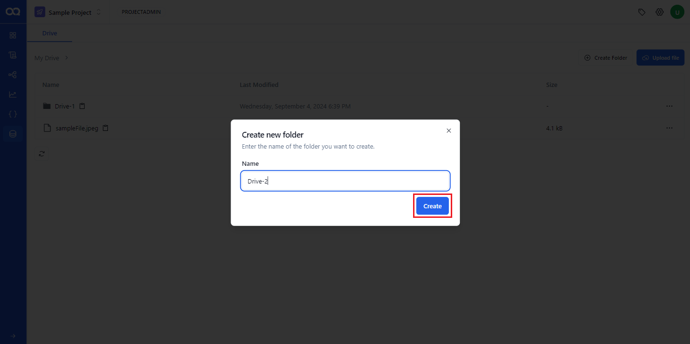

3. The new folder will be listed on the drive.
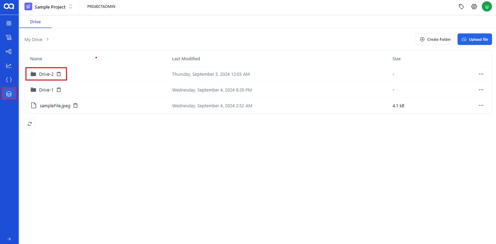

4. Then, go to the test case page and select ‘Download file.’

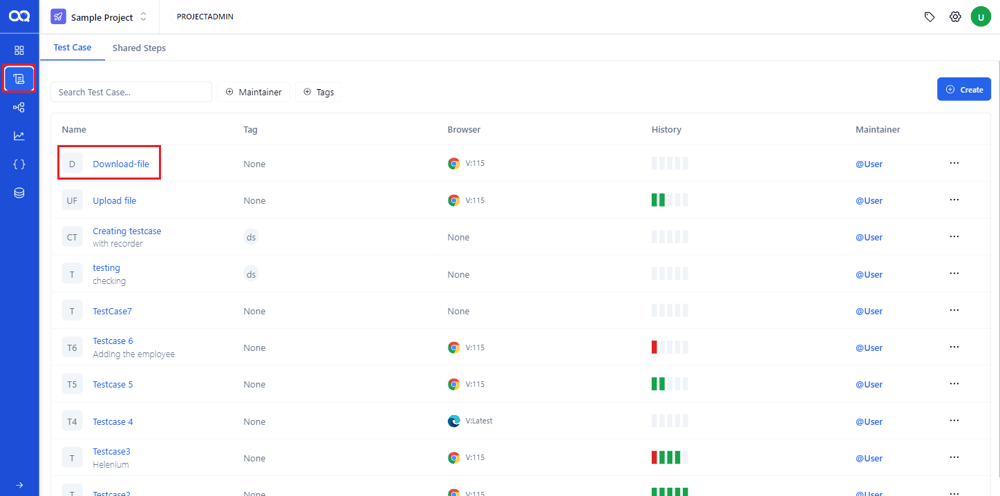

5. Click the ‘Download File’ step, enter the path including the new folder name ('Drive-2') and the file name in the definition field, then click ‘Save’.

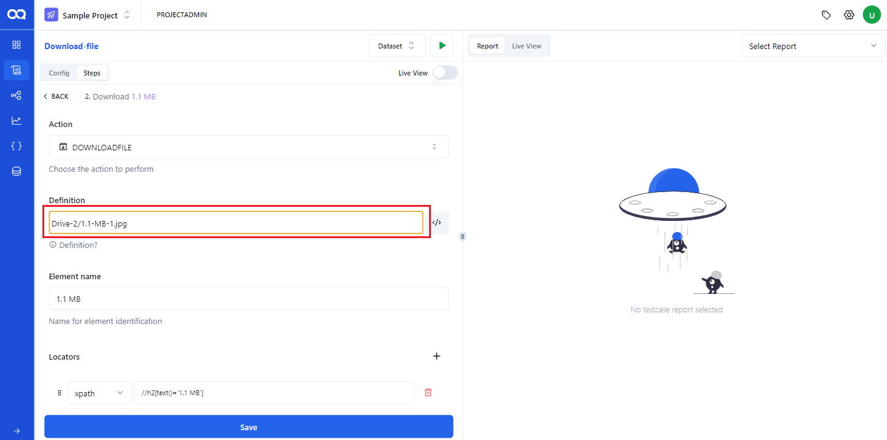

Here, the folder name is **'Drive-2**' and the file name is **'1.1-MB-1.jpg**', the path will be **'Drive-2/1.1-MB-1.jpg**'.

6. Click ‘Run’ to execute the test case and click the download button to download the file.

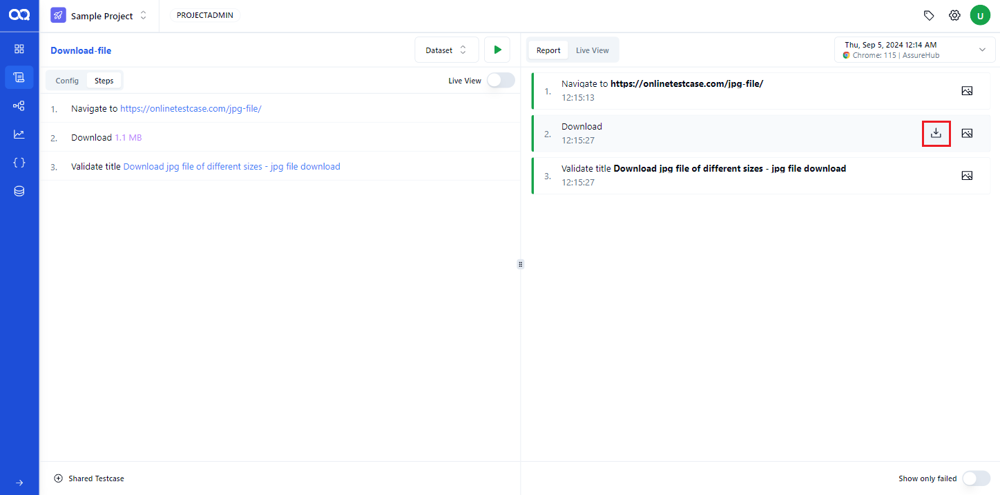

7.Return to the drive page, and click on the ‘Drive-2’ folder to verify that the downloaded file is stored correctly.

The downloaded file should be correctly stored in the ‘Drive-2’ folder.

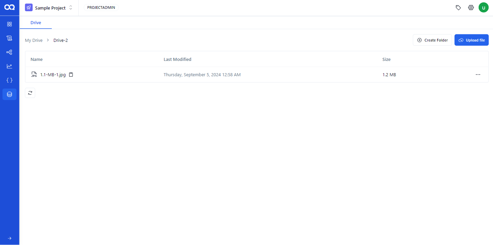

**Create Test step for Uploading File**

In AssureQA, the 'UploadFile' keyword is used to automate file uploading.To use this keyword, you need to specify the file path where the file is saved.
The drive will play a major role in this case. We've already covered how to upload a file to the drive, let's move on to creating a test step using the uploaded file. Follow these steps:

1. Click on the 'Drive-1' folder on the Drive page.

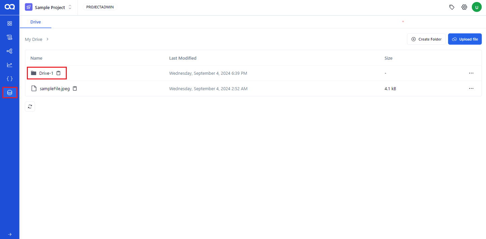

2. On this page, user can copy the file path by clicking the button next to the name of the uploaded file.

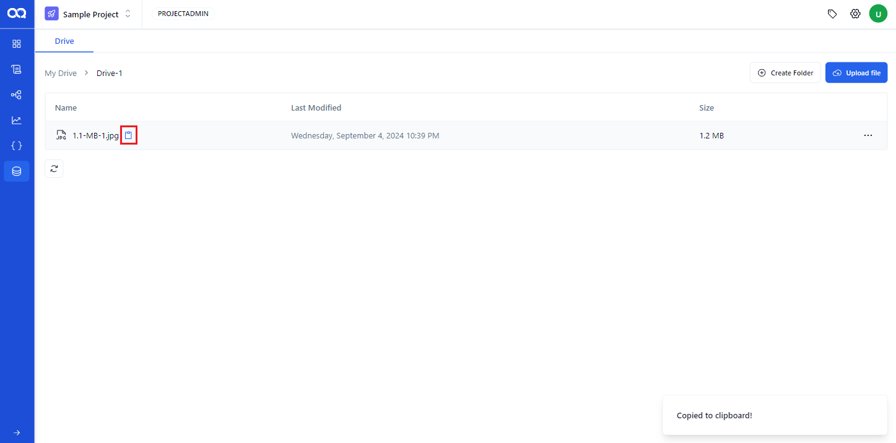

3. When copying the file path this way, the path includes the folder name preceding the file name.
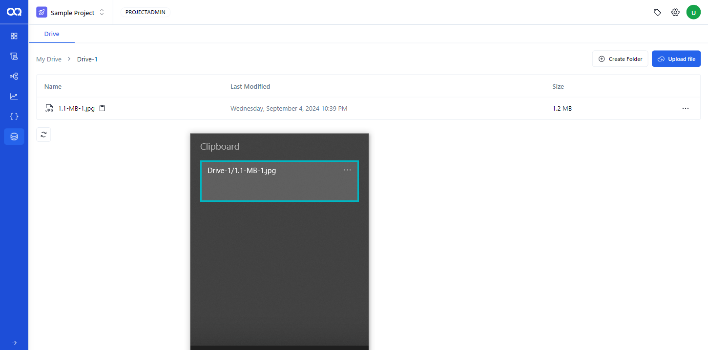

For example, if the folder name is '**Drive-1'** and the file name is **'1.1-MB-1.jpg**', the copied path will be **'Drive-1/1.1-MB-1.jpg**'.
Then, go to the test case page and select the ‘Upload File’ test case.

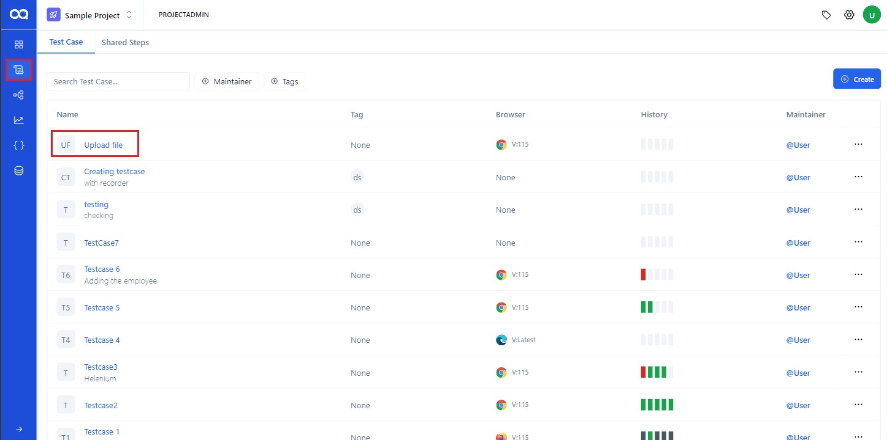

4. Click on the upload file step, paste the copied path into the definition field, and click ‘Save’.

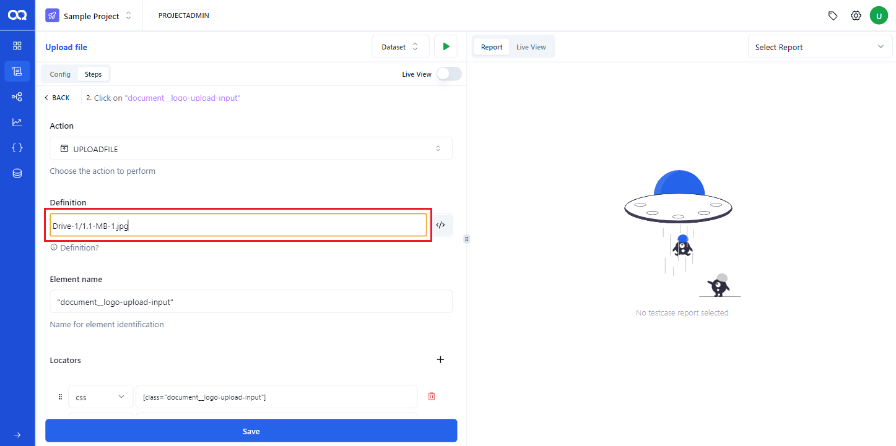

5. Click ‘Run’ to execute the test case. The file present in the drive will be uploaded to the application under test.

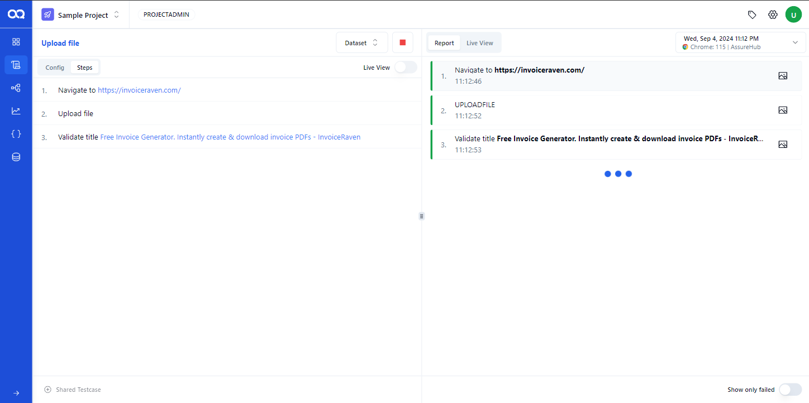

