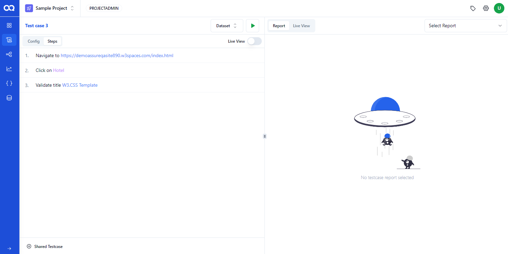
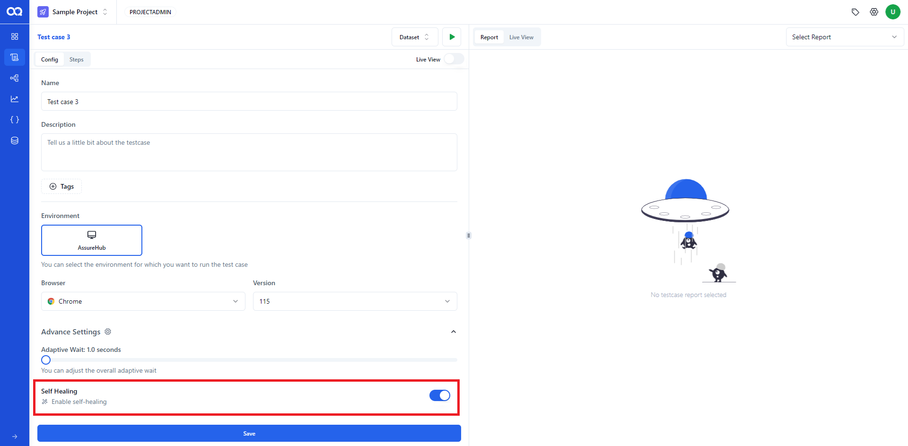
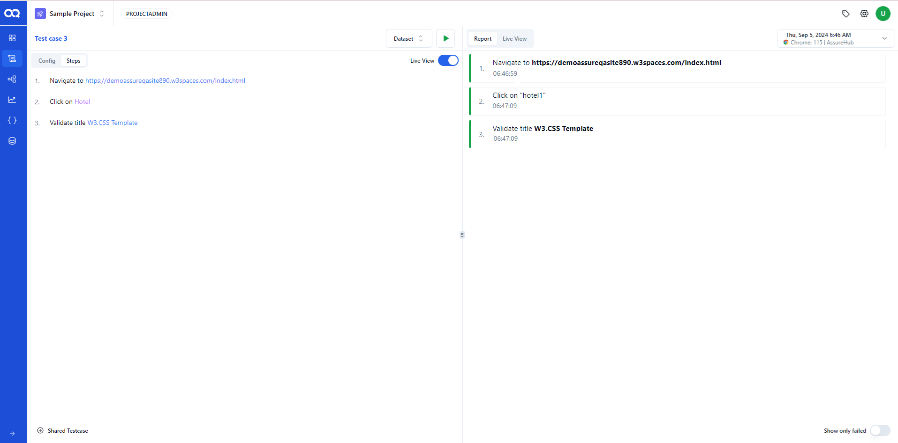
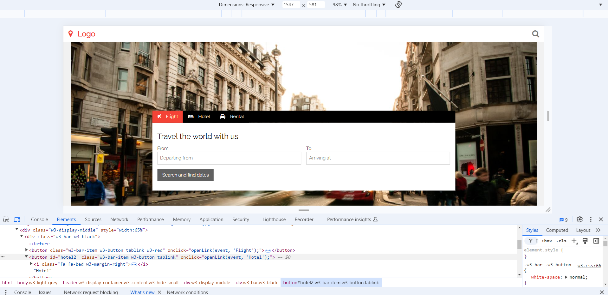
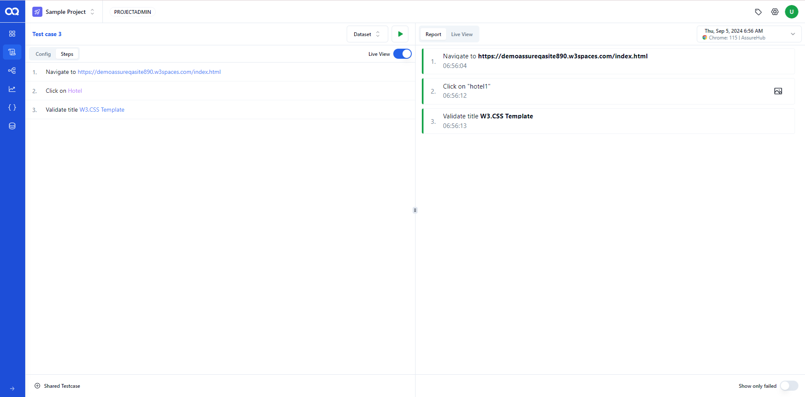

# Self Healing

AssureQA leverages AI to identify and resolve script failures caused by unexpected errors. It employs a method based on script healing and character recognition principles, while also offering traditional element identification through locators. By enabling the script healing method, AssureQA provides flexibility during script execution.

To demonstrate this, let's take a dynamic site in which the elements inside this site are keep changing. Assume that we need to make a click on a button called "Hotels" and it's locator, say id="hotel1" is changing after some time.

1. Copy the url of this site and paste it on the recorder page.
2. Start recording the events like click on the "Hotels" button.
3. Save the recordings and form a testcase
4. Goto the testcase page and select the created testcase

5. Open Config and Enable Self Healing Option marked in the picture.

6. The test case should be executed after saving.
At this time, the test case will be passed.

Assume that now that locator value has been changed.

But without making any changes to the saved locators, we just rerun the testcase. Due to script healing feature, the step with changed locator will be executed successfully. If script healing had happened, then the element on which the action performed will be marked with a red rectangular box in the screenshot.

